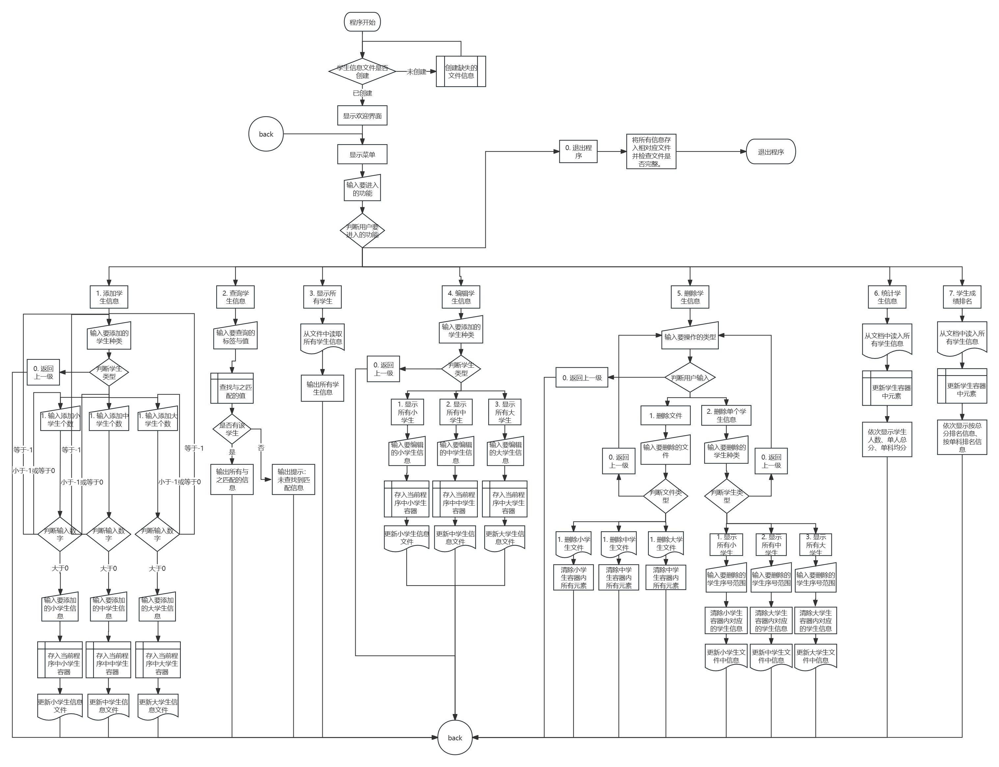

# C++ 课设

## 描述

这是大一上学期的 C++ 课设，实现了如下功能

1. 添加功能：程序能够添加不同学生的记录，提供选择界面供用户选择所要添加的类别，要求学号要唯一，如果添加了重复学号的记录时，则提示数据添加重复并取消添加。
2. 查询功能：可根据学号、姓名等信息对已添加的学生记录进行查询，如果未找到，给出相应的提示信息，如果找到，则显示相应的记录信息。
3. 显示功能：可显示当前系统中所有学生的记录，每条记录占据一行。
4. 编辑功能：可根据查询结果对相应的记录进行修改，修改时注意学号的唯一性。
5. 删除功能：主要实现对已添加的学生记录进行删除。如果当前系统中没有相应的记录，则提示“记录为空！”并返回操作。
6. 统计功能：能根据多种参数进行统计。能统计学生人数、总分、单科的平均分等。
7. 保存功能：可将当前系统中各类记录存入文件中，存入方式任意。
8. 读取功能：可将保存在文件中的信息读入到当前系统中，供用户进行使用。
9. 排序功能：可按总分和单科成绩排名次。

程序流程图如下：

## License

This project use MIT license